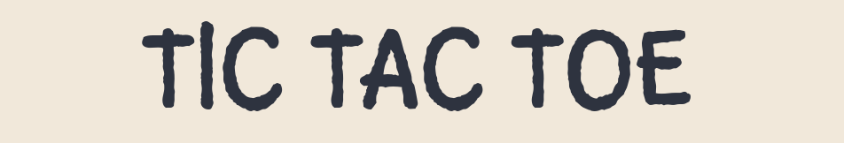
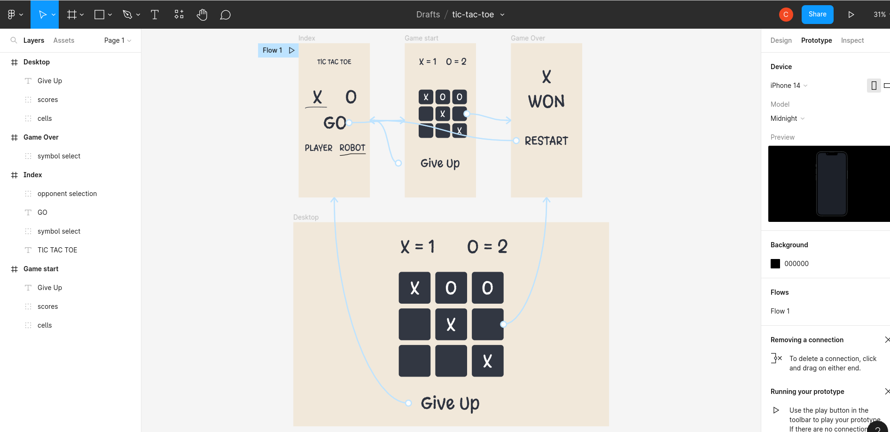
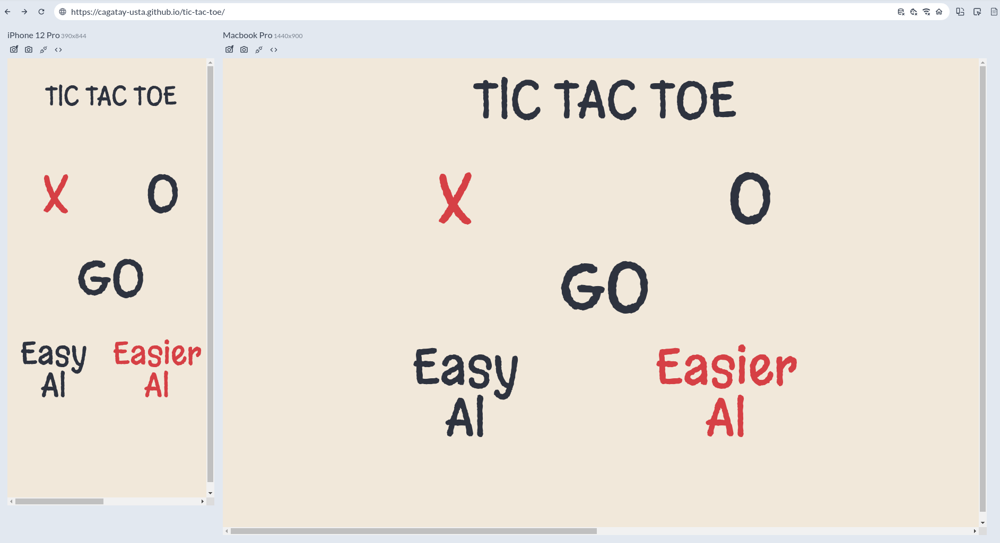
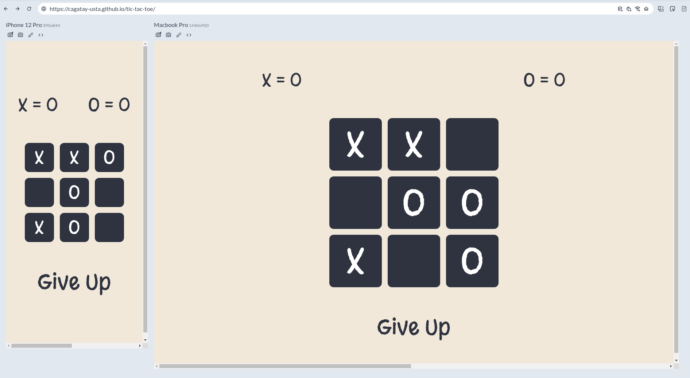

# Description

Tic-Tac-Toe is a classic two-player game where each player takes turns marking spaces on a 3x3 grid. The goal is to get three in a row horizontally, vertically, or diagonally. This version of the game is built as a web application with a responsive design, allowing players to enjoy the game on both desktop and mobile devices. It was built as a homework project from The Odin Project, using HTML, CSS, JavaScript, Vite, Figma and Tailwind CSS as technologies.

  

Check out the live [preview here](https://cagatay-usta.github.io/tic-tac-toe/)

  

 

# Features

- **Responsive Design**: The game is designed to be responsive, adapting to both desktop and mobile devices, providing a consistent and enjoyable user experience.
- **Easy-to-Use Interface**: The game features a simple and intuitive interface that makes it easy for players to understand the rules and play the game.
- **Restart** Button: The "Give Up/Restart" buttons allows players to start a new game at any time.
- **Winner Screen**: The game displays messages to declare the winner and keeps score at all times, making it clear to players when the game has ended.

 

# Story Behind the Build

Before starting this project I looked back at my previous work and spotted some recurring problems in them. Namely:

- Building the visual design "on the go" has been problematic as the new features and components added, css became more complicated and the whole design needed refactoring even in minor changes.
- "Spaghetti Code": although I cared deeply to keep the code clean, as the projects got bigger, as I followed no design patterns and improvised what was needed when I needed, the code got complicated to read.
- Polluting global namespace and using global variable too much.
   
   

Thus in this project my main goals were to focus on possible solutions to those problems:

- Learned Figma to sketch out rough designs so I would have a clear idea how the app would look like and how all the parts would connect even before writing a single line of code, thus I would have a plan for the visual design, which helped me immensely. It also made planning responsive design much easier
- I used Factory and Module Patterns to overcome problems of scalability, code readability and global namespace pollution problems. As I was tackling a new problem and still gaining experience on integrating design patterns to my code, it still resembles a half-cooke spaghetti, but looks much better than my previous works!

Here is a screenshot of my rough skecthes and prototyping from Figma:

And the end result:

 

# Installation

You can use it directly online, hosted on Github Pages [here.](https://cagatay-usta.github.io/tic-tac-toe/)
 
If you rather want to check the source code and modify it:

1. Clone the repository to your local machine using git clone.
2. Navigate to the project directory in your terminal.
3. Install the dependencies using npm install or yarn install.
4. Start the development server using npm run dev or yarn dev.
5. Open your web browser and go to http://localhost:3000 to access the app.
6. If you want to make a new build, refer to Tailwind CSS docs for config settings to minify the css file.

 

# Tech Stack

- 

- 

- 

- 

- 

- 

# Contributing

Contributions to the Tic Tac Toe app are welcome, although not needed as I developed this as a learning project :) If you find any issues or have suggestions for improvements, please feel free to open an issue or submit a pull request. All feedback is appreciated.

# Contact

If you have any feedback, comments, or inquiries, please feel free to contact me. I would be happy to connect with you!

- Email: cagatay_usta@windowslive.com
- GitHub: [cagatay-usta](https://github.com/cagatay-usta)
- LinkedIn: [Cagatay Usta](https://www.linkedin.com/in/cagatay-usta/)

Thank you for checking out my repo!
